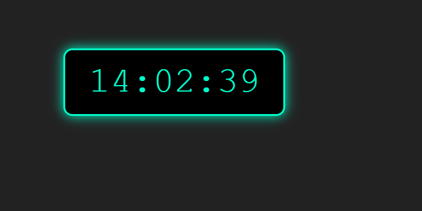

# ⏰ Digital Clock

A simple digital clock built using **HTML**, **CSS**, and **JavaScript**.  
It displays the current time and updates every second.

## 💻 Demo

[Click here to view the live clock](https://your-username.github.io/digital-clock/)  
*(Replace this link with your GitHub Pages link after publishing)*

## 🚀 Features

- Real-time digital clock
- Styled with glowing neon effect
- 24-hour format
- Responsive and minimal design

## 📁 Files

- `index.html` — Main HTML file
- (Optional) `style.css` — CSS styles (if separated)
- (Optional) `script.js` — JavaScript logic (if separated)

## 🛠 Technologies Used

- HTML5
- CSS3
- JavaScript (Vanilla)

## 🧠 How It Works

- Uses `setInterval()` to update the time every second
- Formats hours, minutes, and seconds with leading zeroes
- Displays the time in `HH:MM:SS` format

## 📷 Screenshot

  
*(Add a screenshot of your clock and name it `screenshot.png`)*

## 📜 License

This project is open source and available under the [MIT License](LICENSE).
